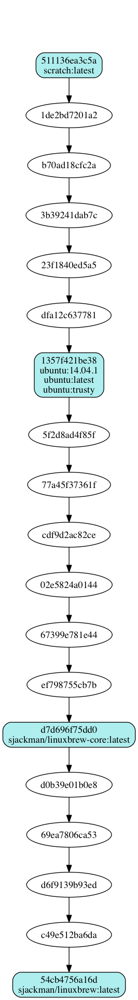

Docker Images for Linuxbrew
================================================================================

## [sjackman/linuxbrew][]
A default [Linuxbrew][] installation

## [sjackman/linuxbrew-standalone][]
A [standalone Linuxbrew][] installation

## [sjackman/linuxbrew-core][]
A bare bones [Linuxbrew][] installation

[Linuxbrew]: http://brew.sh/linuxbrew/
[standalone Linuxbrew]: https://github.com/Homebrew/linuxbrew/wiki/Standalone-Installation

[sjackman/linuxbrew]: linuxbrew/Dockerfile
[sjackman/linuxbrew-core]: linuxbrew-core/Dockerfile
[sjackman/linuxbrew-standalone]: linuxbrew-standalone/Dockerfile
[ubuntu]: https://registry.hub.docker.com/_/ubuntu/

Docker Images
================================================================================

